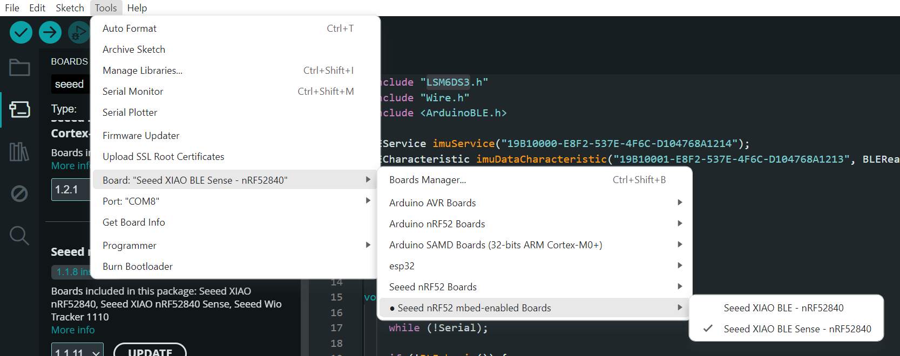

# Integrated Sensor & Scheduler App

This project consists of two components:

1. 🧠 **Sensor Firmware (Hardware)**  
   Arduino-based firmware running on a **Seeed Studio XIAO nRF52840 Sense** that measures **temperature, acceleration, and gyroscope data**, and transmits it via **Bluetooth Low Energy (BLE)**.

2. 📱 **Android App (Software)**  
   An Android application built with **Jetpack Compose** that connects to the BLE device, visualizes sensor data in real-time, and saves sessions to **Firebase** for later viewing. The application also works as a scheduler to plan activities.

---

## ⚙️ How to Set It Up

### 🔧 Hardware Setup

To set up the **BLE sensor firmware**, visit the [`sensor/`](sensor/) folder and follow the instructions in the [`README.md`](sensor/README.md) inside.

1. **Connect your XIAO nRF52840 Sense**  
   Plug the board into your computer via USB-C.

2. **Install Required Libraries in Arduino IDE**  
   - Seeed Arduino LSM6DS3 by Seeed Studio (v2.0.5)  
   - ArduinoBLE by Arduino (v1.3.7 or above)  
   - Seeed nRF52 Boards by Seeed Studio (v1.1.8 or above)  
   - Seeed nRF52 mbed-enabled Boards by Seeed Studio (v2.9.2 or above)

3. **Select the Correct Board and Port**  
   Go to **Tools → Board → Seeed nRF52 mbed-enabled Boards → Seeed XIAO BLE Sense - nRF52840**.

   

4. **Upload the Firmware Sketch**  
   Open the sketch located in the `sensor/` folder and click **Upload**.

5. **Power the Device**  
   - Via USB, the device powers automatically.  
   - **If using a battery**, you must **disconnect the Serial Communication (USB)** to avoid conflicts.

The onboard LED should blink to indicate the device is active.

---

### 💻 Android App Setup

To set up the Android application, visit the [`app/`](app/) folder and follow the instructions in the [`README.md`](app/README.md).

1. **Open the Project in Android Studio**  
   Make sure you have **Android Studio Flamingo** or newer installed.

2. **Connect to the BLE Device**  
   Enable Bluetooth on your Android device and pair with the XIAO BLE sensor.

3. **View Real-Time Graphs**  
   Navigate to the live sensor dashboard to see temperature, acceleration, and gyroscope data in real-time.

4. **Manage Activities**  
   - Add new activities to the schedule  
   - Remove activities from the schedule  
   - Save session data to Firebase

5. **View Historical Data**  
   Access previous sessions and plan future activities using the built-in scheduler.

---

## 📋 Summary

| Component | Folder | Technology | Purpose |
|----------|--------|-------------|---------|
| 🔌 Sensor Firmware | `sensor/` | Arduino + BLE + IMU | Streams sensor data via BLE |
| 📲 Android App | `app/` | Jetpack Compose + Firebase | Graphs & stores the data |

---
